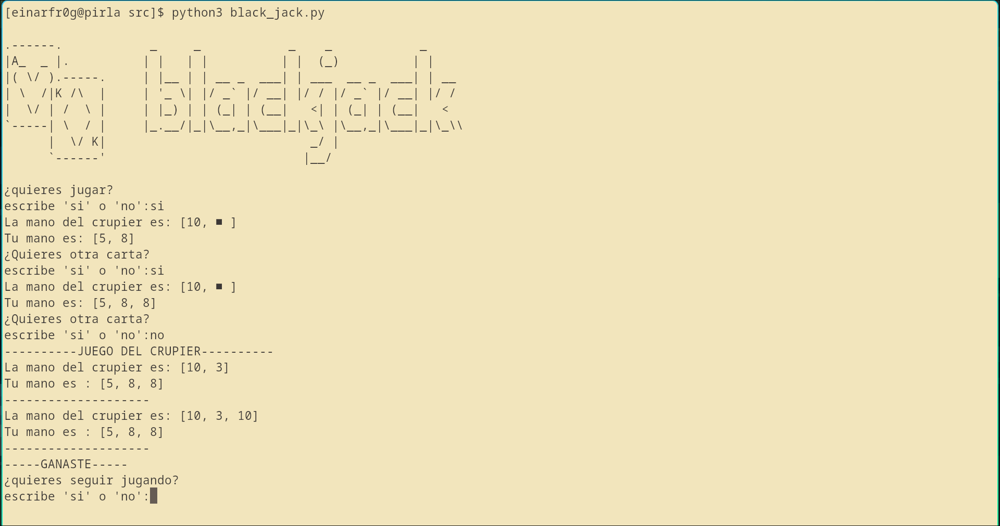

# Terminal_black_jack
Un simple juego de black jack basado en terminal y que es de un solo jugador.
        
## Requisitos
- Tener instalado python3
## Instrucciones de uso
simplemente clona el repositorio y en la carpeta src corre en python3 balack_jack.py y juega, diviertete :).
